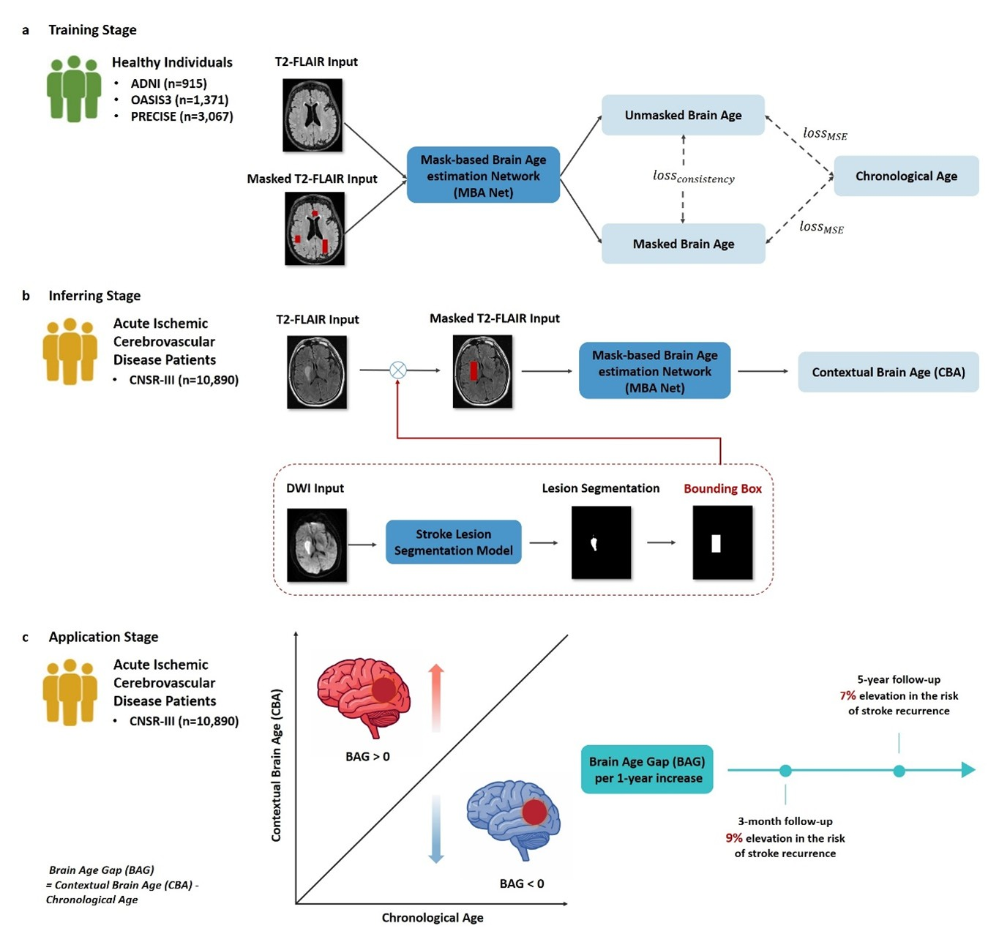

# Deep learning-based brain age predicts stroke recurrence in acute ischemic cerebrovascular disease

Pytorch codes for this paper 

## Abstract

In this paper, we developed a Mask-based Brain Age estimation Network (MBA Net) to predict the non-infarcted brain age, termed the Contextual Brain Age (CBA). 

- First, we trained and validated MBA Net using T2-fluid-attenuated inversion recovery (T2-FLAIR) imaging data from 5,353 healthy individuals, with image masks generated through an automated computational algorithm (Fig. 1a). 
- Subsequently, we applied MBA Net in a large, multicenter, prospective stroke cohort involving 10,890 patients with AICVD. For each patient, image masks were constructed based on infarct regions. The masked T2-FLAIR images were then processed through the MBA Net to estimate the CBA and calculate the BAG (Fig. 1b). 
- Furthermore, we demonstrated that BAG serves as an independent predictor of both short-term and long-term stroke recurrence risk in patients with AICVD (Fig. 1c).




## Using the code:

### **To install all the dependencies using pip:**
The code is stable using Python 3.8, to use it you will need:
 * Python >= 3.8
 * Pytorch >= 1.7
 * numpy
 * nibabel
 * tensorboardX
 * sklearn
 * pandas


### **Data Pre-Processing:**
All T2-FLAIR MRI scans were preprocessed using a standardized FSL-based pipeline. First, each image was rigidly registered to a custom template ([GG-FLAIR-366](http://brainder.org)) using FLIRT and resampled to an isotropic resolution of 2×2×2 mm³ with a fixed matrix size of 91×109×91. Brain extraction was performed using ([SynthStrip](https://surfer.nmr.mgh.harvard.edu/docs/synthstrip/)) to remove non-brain tissues.

For stroke patients, lesion masks derived from DWI were used to exclude infarct regions via masking. Finally, voxel intensities within the brain were z-score normalized, and non-brain areas were set to -1.


### **Training Command:**

Change the model_name, data_path and other settings in main.py to train them

```
# For training the brain age estimation network
python main.py
```


### **Testing Command:**

Change the model_name, data_path and other settings in prediction.py to inference them

```
# For testing the brain age estimation network
python prediction.py
```


## Pre-trained Model
Download the pretrained model: [Beihang Cloud](https://bhpan.buaa.edu.cn/link/AAC507537430DB41979C90BE1D70D96E27)

## Datasets

This study employed two publicly accessible datasets, along with a community cohort, to develop the brain age prediction model: ADNI<sup><a href="#ref1">1</a></sup>, OASIS<sup><a href="#ref2">2</a></sup>, and PRECISE<sup><a href="#ref3">3</a></sup>.

In the clinical application phase, data from the CNSR-III<sup><a href="#ref4">4</a></sup> study were utilized, including 10,890 patients with AIS or TIA who had high-quality T2-FLAIR and DWI imaging

The data from the ADNI database (https://www.adni.loni.usc.edu) and the OASIS database (https://www.oasis-brains.org/) are publicly accessible. The anonymized data from the PRECISE study and the CNSR-III study are available to fellow researchers on request for replicating procedures or reproducing the results by contacting the corresponding author and their institutions.

### Reference

[1]  <span name = "ref1">Weiner, M. W. et al. The Alzheimer's Disease Neuroimaging Initiative 3: Continued innovation for clinical trial improvement. Alzheimers Dement 13, 561-571 (2017).</span>

[2]  <span name = "ref2">Pamela, J. L. et al. OASIS-3: Longitudinal Neuroimaging, Clinical, and 
Cognitive Dataset for Normal Aging and Alzheimer Disease. medRxiv, 
2019.2012.2013.19014902 (2019). </span>

[3]  <span name = "ref3">Pan, Y. et al. PolyvasculaR Evaluation for Cognitive Impairment and vaScular 
Events (PRECISE)-a population-based prospective cohort study: rationale, 
design and baseline participant characteristics. Stroke Vasc Neurol 6, 145-151 
(2021). 
</span>

[4]  <span name = "ref4">Wang, Y. et al. The Third China National Stroke Registry (CNSR-III) for 
patients with acute ischaemic stroke or transient ischaemic attack: design, 
rationale and baseline patient characteristics. Stroke Vasc Neurol 4, 158-164 
(2019). 
</span>

## To Cite Us
Hongyu Zhou, Ziyang Liu, et al. Deep learning-based brain age predicts stroke recurrence in acute ischemic cerebrovascular disease, 2025

